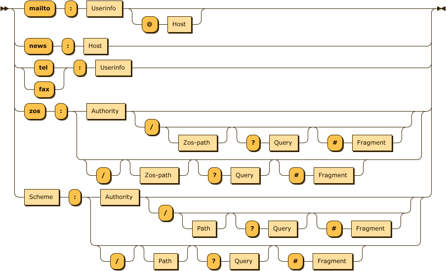

# URI parsers

Due parser di URI, scritti in Lisp e Prolog.
Implementano una versione semplificata dell' [RFC3986](https://datatracker.ietf.org/doc/html/rfc3986)



## Autori

@AdrianC64

@ChrisD184

@robalb


## Test automatizzati

Per eseguire i test:

- [installare docker](https://docs.docker.com/get-docker/)

- eseguire i comandi

  ```console
  docker build -t uri_parser_tests .
  docker run uri_parser_tests
  ```

## Specifiche trascritte in eBNF
Di seguito è riportata la sintassi degli URI come descritta nella consegna, trascritta in [W3C-style](https://www.w3.org/TR/2010/REC-xquery-20101214/#EBNFNotation) Extended Backus–Naur form.

Consultabile tramite [diagramma interattivo](./docs/index.md)

```eBNF

URI          ::= 'mailto' ':' Userinfo ('@' Host)?
               | 'news' ':' Host
               | ('tel' | 'fax') ':' Userinfo
               | 'zos' ':' Zos-URI
               | Scheme ':' Generic-URI
               
Generic-URI  ::= Authority ( '/' (Path)? ('?' Query)? ('#' Fragment)? )?
               | ('/')? (Path)? ('?' Query)? ('#' Fragment)?

Zos-URI      ::= Authority ( '/' (Zos-path)? ('?' Query)? ('#' Fragment)? )?
               | ('/')? (Zos-path)? ('?' Query)? ('#' Fragment)?

/* Nota: Scheme deve essere diverso dagli schemi speciali già definiti: mailto, news, zos.. */
Scheme       ::= Identificatore

Authority    ::= '//' (Userinfo '@')? Host (':' Port)?

Userinfo     ::= Identificatore

Host         ::= Identificatore-host ('.' Identificatore-host)*
               | Indirizzo-IP

Port         ::= (Digit)+

Indirizzo-IP ::= 'NNN.NNN.NNN.NNN'

Path         ::= Identificatore ('/' Identificatore)*

/* La lunghezza di id44 è al massimo 44 e quella di id8 è al massimo 8. Inoltre, id44 e
id8 devono iniziare con un carattere alfabetico; id44 non può terminare con un ‘.’. */
Zos-path     ::= Id44 ( '(' Id8 ')' )?

Id44         ::= (Alpha | '.' )+

Id8          ::= (Alpha)+

Query        ::= Identificatore-query

Fragment     ::= Identificatore-fragment


/* definizione identificatori. è da chiarire cosa si intende per caratteri. 
   é intuitivo pensare alla definizione dell'rfc, con l'esclusione delle codifiche utf-8_url-encoded e punycode
   ma questo non giustificherebbe la necessità di frasi come 'caratteri senza #' */

Identificatore-fragment ::= ( 'caratteri' )+
Identificatore-query    ::= ( 'caratteri senza #' )+
Identificatore          ::= ( 'caratteri senza # ? / @ :' )+
Identificatore-host     ::= ( 'caratteri senza # ? / @ : .' )+

Digit     ::= [0-9]
Alpha     ::= [0-9a-zA-Z]


```

## Crediti

diagrammi generati tramite https://github.com/GuntherRademacher/rr
