# diagramma URI

      

      
<a name="URI">URI:</a>
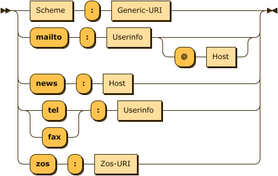<map name="URI.map"><area shape="rect" coords="49,1,119,33" href="#Scheme" title="Scheme"><area shape="rect" coords="183,1,279,33" href="#Generic-URI" title="Generic-URI"><area shape="rect" coords="175,45,247,77" href="#Userinfo" title="Userinfo"><area shape="rect" coords="339,77,387,109" href="#Host" title="Host"><area shape="rect" coords="169,121,217,153" href="#Host" title="Host"><area shape="rect" coords="193,165,265,197" href="#Userinfo" title="Userinfo"><area shape="rect" coords="155,253,225,285" href="#Zos-URI" title="Zos-URI"></map>

         
         
<code>
               
               
<a href="#URI" title="URI">URI</a>&nbsp;&nbsp;&nbsp;&nbsp;&nbsp;&nbsp;::= <a href="#Scheme" title="Scheme">Scheme</a> ':' <a href="#Generic-URI" title="Generic-URI">Generic-URI</a>

               
               
&nbsp;&nbsp;&nbsp;&nbsp;&nbsp;&nbsp;&nbsp;&nbsp;&nbsp;&nbsp;&nbsp;| 'mailto' ':' <a href="#Userinfo" title="Userinfo">Userinfo</a> ( '@' <a href="#Host" title="Host">Host</a> )?

               
               
&nbsp;&nbsp;&nbsp;&nbsp;&nbsp;&nbsp;&nbsp;&nbsp;&nbsp;&nbsp;&nbsp;| 'news' ':' <a href="#Host" title="Host">Host</a>

               
               
&nbsp;&nbsp;&nbsp;&nbsp;&nbsp;&nbsp;&nbsp;&nbsp;&nbsp;&nbsp;&nbsp;| ( 'tel' | 'fax' ) ':' <a href="#Userinfo" title="Userinfo">Userinfo</a>

               
               
&nbsp;&nbsp;&nbsp;&nbsp;&nbsp;&nbsp;&nbsp;&nbsp;&nbsp;&nbsp;&nbsp;| 'zos' ':' <a href="#Zos-URI" title="Zos-URI">Zos-URI</a>
</code>

         

      
      
no references
 
<a name="Generic-URI">Generic-URI:</a>
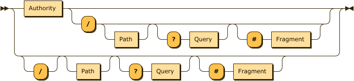<map name="Generic-URI.map"><area shape="rect" coords="49,1,127,33" href="#Authority" title="Authority"><area shape="rect" coords="235,65,283,97" href="#Path" title="Path"><area shape="rect" coords="389,65,447,97" href="#Query" title="Query"><area shape="rect" coords="557,65,637,97" href="#Fragment" title="Fragment"><area shape="rect" coords="157,131,205,163" href="#Path" title="Path"><area shape="rect" coords="311,131,369,163" href="#Query" title="Query"><area shape="rect" coords="479,131,559,163" href="#Fragment" title="Fragment"></map>

         
         
<code>
               
               
<a href="#Generic-URI" title="Generic-URI">Generic-URI</a>

               
               
&nbsp;&nbsp;&nbsp;&nbsp;&nbsp;&nbsp;&nbsp;&nbsp;&nbsp;::= <a href="#Authority" title="Authority">Authority</a> ( '/' <a href="#Path" title="Path">Path</a>? ( '?' <a href="#Query" title="Query">Query</a> )? ( '#' <a href="#Fragment" title="Fragment">Fragment</a> )? )?

               
               
&nbsp;&nbsp;&nbsp;&nbsp;&nbsp;&nbsp;&nbsp;&nbsp;&nbsp;&nbsp;&nbsp;| '/'? <a href="#Path" title="Path">Path</a>? ( '?' <a href="#Query" title="Query">Query</a> )? ( '#' <a href="#Fragment" title="Fragment">Fragment</a> )?
</code>

         

      
      
referenced by:
         
         <ul>
            
            <li><a href="#URI" title="URI">URI</a></li>
            </ul>
         
 
<a name="Zos-URI">Zos-URI:</a>
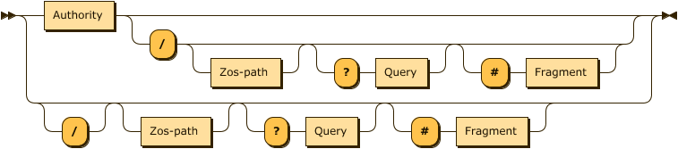<map name="Zos-URI.map"><area shape="rect" coords="49,1,127,33" href="#Authority" title="Authority"><area shape="rect" coords="235,65,313,97" href="#Zos-path" title="Zos-path"><area shape="rect" coords="419,65,477,97" href="#Query" title="Query"><area shape="rect" coords="587,65,667,97" href="#Fragment" title="Fragment"><area shape="rect" coords="157,131,235,163" href="#Zos-path" title="Zos-path"><area shape="rect" coords="341,131,399,163" href="#Query" title="Query"><area shape="rect" coords="509,131,589,163" href="#Fragment" title="Fragment"></map>

         
         
<code>
               
               
<a href="#Zos-URI" title="Zos-URI">Zos-URI</a>&nbsp;&nbsp;::= <a href="#Authority" title="Authority">Authority</a> ( '/' <a href="#Zos-path" title="Zos-path">Zos-path</a>? ( '?' <a href="#Query" title="Query">Query</a> )? ( '#' <a href="#Fragment" title="Fragment">Fragment</a> )? )?

               
               
&nbsp;&nbsp;&nbsp;&nbsp;&nbsp;&nbsp;&nbsp;&nbsp;&nbsp;&nbsp;&nbsp;| '/'? <a href="#Zos-path" title="Zos-path">Zos-path</a>? ( '?' <a href="#Query" title="Query">Query</a> )? ( '#' <a href="#Fragment" title="Fragment">Fragment</a> )?
</code>

         

      
      
referenced by:
         
         <ul>
            
            <li><a href="#URI" title="URI">URI</a></li>
            </ul>
         
 
<a name="Scheme">Scheme:</a>
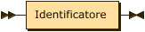<map name="Scheme.map"><area shape="rect" coords="29,1,133,33" href="#Identificatore" title="Identificatore"></map>

         
         
<code>
               
               
<a href="#Scheme" title="Scheme">Scheme</a>&nbsp;&nbsp;&nbsp;::= <a href="#Identificatore" title="Identificatore">Identificatore</a>
</code>

         

      
      
referenced by:
         
         <ul>
            
            <li><a href="#URI" title="URI">URI</a></li>
            </ul>
         
 
<a name="Authority">Authority:</a>
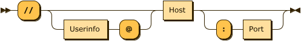<map name="Authority.map"><area shape="rect" coords="105,33,177,65" href="#Userinfo" title="Userinfo"><area shape="rect" coords="269,1,317,33" href="#Host" title="Host"><area shape="rect" coords="401,33,447,65" href="#Port" title="Port"></map>

         
         
<code>
               
               
<a href="#Authority" title="Authority">Authority</a>

               
               
&nbsp;&nbsp;&nbsp;&nbsp;&nbsp;&nbsp;&nbsp;&nbsp;&nbsp;::= '//' ( <a href="#Userinfo" title="Userinfo">Userinfo</a> '@' )? <a href="#Host" title="Host">Host</a> ( ':' <a href="#Port" title="Port">Port</a> )?
</code>

         

      
      
referenced by:
         
         <ul>
            
            <li><a href="#Generic-URI" title="Generic-URI">Generic-URI</a></li>
            
            <li><a href="#Zos-URI" title="Zos-URI">Zos-URI</a></li>
            </ul>
         
 
<a name="Userinfo">Userinfo:</a>
<map name="Userinfo.map"><area shape="rect" coords="29,1,133,33" href="#Identificatore" title="Identificatore"></map>

         
         
<code>
               
               
<a href="#Userinfo" title="Userinfo">Userinfo</a>&nbsp;::= <a href="#Identificatore" title="Identificatore">Identificatore</a>
</code>

         

      
      
referenced by:
         
         <ul>
            
            <li><a href="#Authority" title="Authority">Authority</a></li>
            
            <li><a href="#URI" title="URI">URI</a></li>
            </ul>
         
 
<a name="Host">Host:</a>
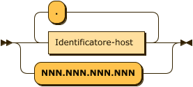<map name="Host.map"><area shape="rect" coords="69,45,207,77" href="#Identificatore-host" title="Identificatore-host"></map>

         
         
<code>
               
               
<a href="#Host" title="Host">Host</a>&nbsp;&nbsp;&nbsp;&nbsp;&nbsp;::= <a href="#Identificatore-host" title="Identificatore-host">Identificatore-host</a> ( '.' <a href="#Identificatore-host" title="Identificatore-host">Identificatore-host</a> )*

               
               
&nbsp;&nbsp;&nbsp;&nbsp;&nbsp;&nbsp;&nbsp;&nbsp;&nbsp;&nbsp;&nbsp;| 'NNN.NNN.NNN.NNN'
</code>

         

      
      
referenced by:
         
         <ul>
            
            <li><a href="#Authority" title="Authority">Authority</a></li>
            
            <li><a href="#URI" title="URI">URI</a></li>
            </ul>
         
 
<a name="Port">Port:</a>
<map name="Port.map"><area shape="rect" coords="49,17,97,49" href="#Digit" title="Digit"></map>

         
         
<code>
               
               
<a href="#Port" title="Port">Port</a>&nbsp;&nbsp;&nbsp;&nbsp;&nbsp;::= <a href="#Digit" title="Digit">Digit</a>+
</code>

         

      
      
referenced by:
         
         <ul>
            
            <li><a href="#Authority" title="Authority">Authority</a></li>
            </ul>
         
 
<a name="Path">Path:</a>
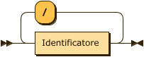<map name="Path.map"><area shape="rect" coords="49,45,153,77" href="#Identificatore" title="Identificatore"></map>

         
         
<code>
               
               
<a href="#Path" title="Path">Path</a>&nbsp;&nbsp;&nbsp;&nbsp;&nbsp;::= <a href="#Identificatore" title="Identificatore">Identificatore</a> ( '/' <a href="#Identificatore" title="Identificatore">Identificatore</a> )*
</code>

         

      
      
referenced by:
         
         <ul>
            
            <li><a href="#Generic-URI" title="Generic-URI">Generic-URI</a></li>
            </ul>
         
 
<a name="Zos-path">Zos-path:</a>
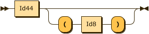<map name="Zos-path.map"><area shape="rect" coords="29,1,77,33" href="#Id44" title="Id44"><area shape="rect" coords="163,33,203,65" href="#Id8" title="Id8"></map>

         
         
<code>
               
               
<a href="#Zos-path" title="Zos-path">Zos-path</a>&nbsp;::= <a href="#Id44" title="Id44">Id44</a> ( '(' <a href="#Id8" title="Id8">Id8</a> ')' )?
</code>

         

      
      
referenced by:
         
         <ul>
            
            <li><a href="#Zos-URI" title="Zos-URI">Zos-URI</a></li>
            </ul>
         
 
<a name="Id44">Id44:</a>
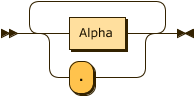<map name="Id44.map"><area shape="rect" coords="69,17,125,49" href="#Alpha" title="Alpha"></map>

         
         
<code>
               
               
<a href="#Id44" title="Id44">Id44</a>&nbsp;&nbsp;&nbsp;&nbsp;&nbsp;::= ( <a href="#Alpha" title="Alpha">Alpha</a> | '.' )+
</code>

         

      
      
referenced by:
         
         <ul>
            
            <li><a href="#Zos-path" title="Zos-path">Zos-path</a></li>
            </ul>
         
 
<a name="Id8">Id8:</a>
<map name="Id8.map"><area shape="rect" coords="49,17,105,49" href="#Alpha" title="Alpha"></map>

         
         
<code>
               
               
<a href="#Id8" title="Id8">Id8</a>&nbsp;&nbsp;&nbsp;&nbsp;&nbsp;&nbsp;::= <a href="#Alpha" title="Alpha">Alpha</a>+
</code>

         

      
      
referenced by:
         
         <ul>
            
            <li><a href="#Zos-path" title="Zos-path">Zos-path</a></li>
            </ul>
         
 
<a name="Query">Query:</a>
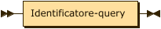<map name="Query.map"><area shape="rect" coords="29,1,175,33" href="#Identificatore-query" title="Identificatore-query"></map>

         
         
<code>
               
               
<a href="#Query" title="Query">Query</a>&nbsp;&nbsp;&nbsp;&nbsp;::= <a href="#Identificatore-query" title="Identificatore-query">Identificatore-query</a>
</code>

         

      
      
referenced by:
         
         <ul>
            
            <li><a href="#Generic-URI" title="Generic-URI">Generic-URI</a></li>
            
            <li><a href="#Zos-URI" title="Zos-URI">Zos-URI</a></li>
            </ul>
         
 
<a name="Fragment">Fragment:</a>
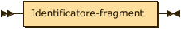<map name="Fragment.map"><area shape="rect" coords="29,1,197,33" href="#Identificatore-fragment" title="Identificatore-fragment"></map>

         
         
<code>
               
               
<a href="#Fragment" title="Fragment">Fragment</a>&nbsp;::= <a href="#Identificatore-fragment" title="Identificatore-fragment">Identificatore-fragment</a>
</code>

         

      
      
referenced by:
         
         <ul>
            
            <li><a href="#Generic-URI" title="Generic-URI">Generic-URI</a></li>
            
            <li><a href="#Zos-URI" title="Zos-URI">Zos-URI</a></li>
            </ul>
         
 
<a name="Identificatore-fragment">Identificatore-fragment:</a>
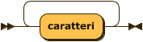

         
         
<code>
               
               
<a href="#Identificatore-fragment" title="Identificatore-fragment">Identificatore-fragment</a>

               
               
&nbsp;&nbsp;&nbsp;&nbsp;&nbsp;&nbsp;&nbsp;&nbsp;&nbsp;::= 'caratteri'+
</code>

         

      
      
referenced by:
         
         <ul>
            
            <li><a href="#Fragment" title="Fragment">Fragment</a></li>
            </ul>
         
 
<a name="Identificatore-query">Identificatore-query:</a>
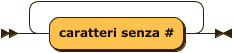

         
         
<code>
               
               
<a href="#Identificatore-query" title="Identificatore-query">Identificatore-query</a>

               
               
&nbsp;&nbsp;&nbsp;&nbsp;&nbsp;&nbsp;&nbsp;&nbsp;&nbsp;::= 'caratteri senza #'+
</code>

         

      
      
referenced by:
         
         <ul>
            
            <li><a href="#Query" title="Query">Query</a></li>
            </ul>
         
 
<a name="Identificatore">Identificatore:</a>
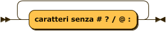

         
         
<code>
               
               
<a href="#Identificatore" title="Identificatore">Identificatore</a>

               
               
&nbsp;&nbsp;&nbsp;&nbsp;&nbsp;&nbsp;&nbsp;&nbsp;&nbsp;::= 'caratteri senza # ? / @ :'+
</code>

         

      
      
referenced by:
         
         <ul>
            
            <li><a href="#Path" title="Path">Path</a></li>
            
            <li><a href="#Scheme" title="Scheme">Scheme</a></li>
            
            <li><a href="#Userinfo" title="Userinfo">Userinfo</a></li>
            </ul>
         
 
<a name="Identificatore-host">Identificatore-host:</a>
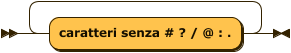

         
         
<code>
               
               
<a href="#Identificatore-host" title="Identificatore-host">Identificatore-host</a>

               
               
&nbsp;&nbsp;&nbsp;&nbsp;&nbsp;&nbsp;&nbsp;&nbsp;&nbsp;::= 'caratteri senza # ? / @ : .'+
</code>

         

      
      
referenced by:
         
         <ul>
            
            <li><a href="#Host" title="Host">Host</a></li>
            </ul>
         
 
<a name="Digit">Digit:</a>
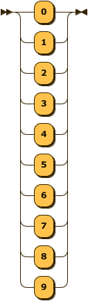

         
         
<code>
               
               
<a href="#Digit" title="Digit">Digit</a>&nbsp;&nbsp;&nbsp;&nbsp;::= '0'

               
               
&nbsp;&nbsp;&nbsp;&nbsp;&nbsp;&nbsp;&nbsp;&nbsp;&nbsp;&nbsp;&nbsp;| '1'

               
               
&nbsp;&nbsp;&nbsp;&nbsp;&nbsp;&nbsp;&nbsp;&nbsp;&nbsp;&nbsp;&nbsp;| '2'

               
               
&nbsp;&nbsp;&nbsp;&nbsp;&nbsp;&nbsp;&nbsp;&nbsp;&nbsp;&nbsp;&nbsp;| '3'

               
               
&nbsp;&nbsp;&nbsp;&nbsp;&nbsp;&nbsp;&nbsp;&nbsp;&nbsp;&nbsp;&nbsp;| '4'

               
               
&nbsp;&nbsp;&nbsp;&nbsp;&nbsp;&nbsp;&nbsp;&nbsp;&nbsp;&nbsp;&nbsp;| '5'

               
               
&nbsp;&nbsp;&nbsp;&nbsp;&nbsp;&nbsp;&nbsp;&nbsp;&nbsp;&nbsp;&nbsp;| '6'

               
               
&nbsp;&nbsp;&nbsp;&nbsp;&nbsp;&nbsp;&nbsp;&nbsp;&nbsp;&nbsp;&nbsp;| '7'

               
               
&nbsp;&nbsp;&nbsp;&nbsp;&nbsp;&nbsp;&nbsp;&nbsp;&nbsp;&nbsp;&nbsp;| '8'

               
               
&nbsp;&nbsp;&nbsp;&nbsp;&nbsp;&nbsp;&nbsp;&nbsp;&nbsp;&nbsp;&nbsp;| '9'
</code>

         

      
      
referenced by:
         
         <ul>
            
            <li><a href="#Port" title="Port">Port</a></li>
            </ul>
         
 
<a name="Alpha">Alpha:</a>
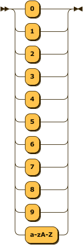

         
         
<code>
               
               
<a href="#Alpha" title="Alpha">Alpha</a>&nbsp;&nbsp;&nbsp;&nbsp;::= '0'

               
               
&nbsp;&nbsp;&nbsp;&nbsp;&nbsp;&nbsp;&nbsp;&nbsp;&nbsp;&nbsp;&nbsp;| '1'

               
               
&nbsp;&nbsp;&nbsp;&nbsp;&nbsp;&nbsp;&nbsp;&nbsp;&nbsp;&nbsp;&nbsp;| '2'

               
               
&nbsp;&nbsp;&nbsp;&nbsp;&nbsp;&nbsp;&nbsp;&nbsp;&nbsp;&nbsp;&nbsp;| '3'

               
               
&nbsp;&nbsp;&nbsp;&nbsp;&nbsp;&nbsp;&nbsp;&nbsp;&nbsp;&nbsp;&nbsp;| '4'

               
               
&nbsp;&nbsp;&nbsp;&nbsp;&nbsp;&nbsp;&nbsp;&nbsp;&nbsp;&nbsp;&nbsp;| '5'

               
               
&nbsp;&nbsp;&nbsp;&nbsp;&nbsp;&nbsp;&nbsp;&nbsp;&nbsp;&nbsp;&nbsp;| '6'

               
               
&nbsp;&nbsp;&nbsp;&nbsp;&nbsp;&nbsp;&nbsp;&nbsp;&nbsp;&nbsp;&nbsp;| '7'

               
               
&nbsp;&nbsp;&nbsp;&nbsp;&nbsp;&nbsp;&nbsp;&nbsp;&nbsp;&nbsp;&nbsp;| '8'

               
               
&nbsp;&nbsp;&nbsp;&nbsp;&nbsp;&nbsp;&nbsp;&nbsp;&nbsp;&nbsp;&nbsp;| '9'

               
               
&nbsp;&nbsp;&nbsp;&nbsp;&nbsp;&nbsp;&nbsp;&nbsp;&nbsp;&nbsp;&nbsp;| 'a-zA-Z'
</code>

         

      
      
referenced by:
         
         <ul>
            
            <li><a href="#Id44" title="Id44">Id44</a></li>
            
            <li><a href="#Id8" title="Id8">Id8</a></li>
            </ul>
         
 

      
      

         
         <table class="signature" border="0">
            
            <tr>
               
               <td style="width: 100%">&nbsp;</td>
               
               <td valign="top">
                  
                  <nobr class="signature">... generated by <a name="Railroad-Diagram-Generator" class="signature" title="https://bottlecaps.de/rr/ui" href="https://bottlecaps.de/rr/ui" target="_blank">RR - Railroad Diagram Generator</a></nobr>
                  </td>
               
               <td></td>
               </tr>
            </table>
         

